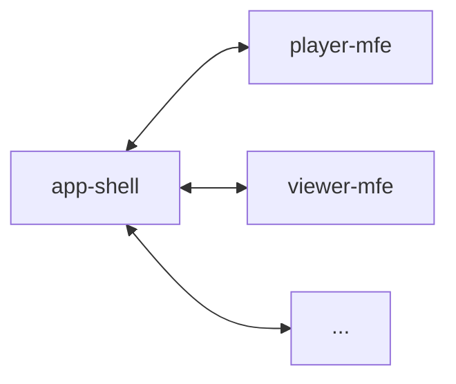

# app-shell

This folder contains the source code for the `Application Shell` of SSL Core. It is a container application that is developed, tested, and deployed independently of the microfrontends, integrating them into a unified experience.



## How it works

The `Application Shell` serves as a container for the frontend of SSL Core. It acts as an entry point for the client, handling routing, composition, and communication.

The app shell exposes various routes for user features, which are accessible via the left sidebar. When a user navigates to a route, the app shell consults `routes.yaml` to determine which microfrontends should be mounted on that page. It then fetches these microfrontends and provides common functionalities such as an event bus for communication (via `Broadcast Channel`) and shortcuts handling.

## Development

To run the development server, use the following commands:

```bash
yarn
yarn dev
```

### Codemap

- [`public`](public): Static files for the microfrontend.
- [`src`](src): Source code for the microfrontend.
- [`src/app`](src/app): Core application logic.
- [`src/assets`](src/assets): Application assets.
- [`src/config`](src/config): Configuration files.
- [`src/styles`](src/styles): Application styles.
- [`src/templates`](src/templates): Template pages to be rendered.
- [`src/main.ts`](src/main.ts): Entry point of the application.
