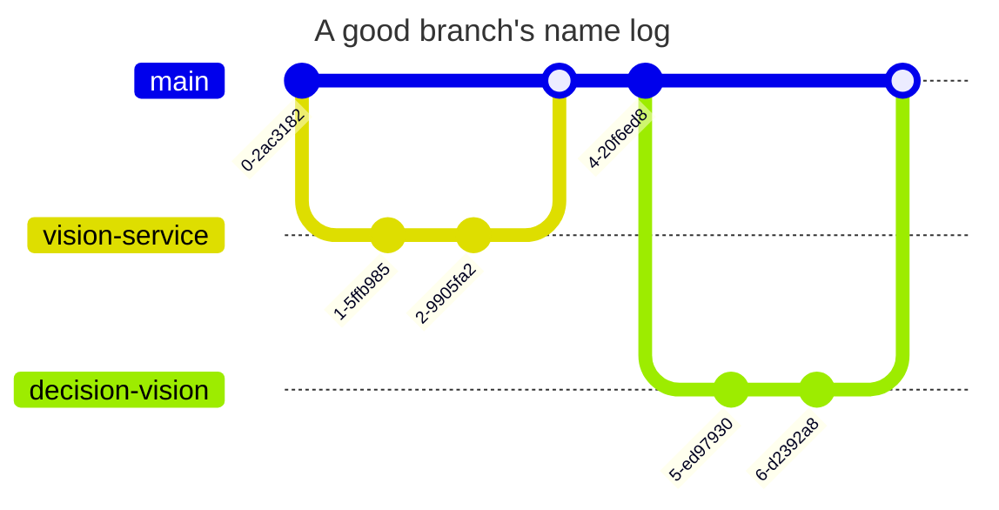
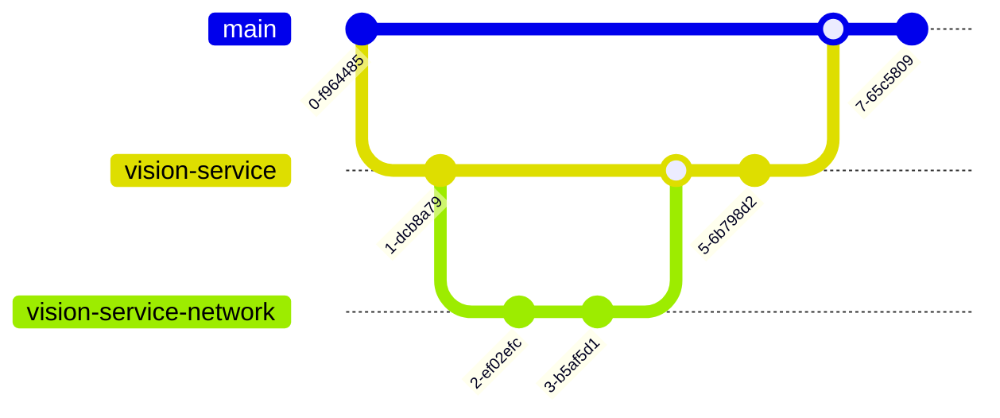

# Contribution Guidelines

This document will guide you through the process of committing code to the `ssl-core` repository.


> **Note:** Each `ssl-core` top-level directory may have different [code contribution standards](coding-standards.md). Check the existing [global](README.md) and service-specific documentations.

## Creating Branches

### Rules

Since commits and pull requests have more visibility, there are a few rules to follow when creating branches. In essence, they are:

- Branch names must be alphanumeric, lowercase and may contain hyphens (`-`)
- The branch name **must be descriptive** of the changes you are making, but not too long

**Good**

- vision-microservice
- ronaldinho-state-machine
- r10-state-machine
- multicast-udp-receiver

**Bad**

- vision_microservice
- wip
- fix
- AddJavaCommonLibrary

**Very Bad**

- feat(vision_microservice)
- +/-
- 4342098
- \_\_init\_\_
- Add: JavaCommonLibrary



Branches should have a 1:1 relationship with [pull requests](#creating-pull-requests). Every feature should end up in the `main`, but you can create a branch to be merged into another branch, which will mean an intermediate stage of development:



To maintain synchronization, it's advisable to regularly merge the `main` branch into your feature branch:


This practice ensures that your branch remains up-to-date with the latest changes, fostering a cohesive and continuously evolving codebase.

## Committing Code

> **Note:** Many RobôCIn members suggest using [GitKraken](https://www.gitkraken.com) to make it easier to visualize and understand git commands. Part of this document follows its conventions, see [GitKraken's Git Commit Message](https://www.gitkraken.com/learn/git/best-practices/git-commit-message) for more information.

### Rules

> **Note:** Some of below rules are based on [Chris Beams' How to Write a Git Commit Message](https://chris.beams.io/posts/git-commit/).

- Commit messages must have a commit message title and may have body copy
- The commit message title must be 72 characters or less
- The commit message title should be capitalized and must not end in a period
- The commit message title must be written in imperative mood (*Fix*, not *Fixed* / *Fixes* etc.)
- The commit message body has no character limit
- The commit message body must only contain explanations as to *what* and *why*, never *how*

**Although it's always good to provide as much information as possible when committing, we encourage you to be much more thorough in [describing a pull request](#describing) than a commit, where a maximum of 72 characters is ideal.**

### Example

This is an example of a complete commit message that adheres to this standard. Parts of this are optional, so read on.

```txt
Summarize changes in around 72 characters or less

More detailed explanatory text, if necessary. Explain the problem that this commit is solving. Focus on why you are making this change as opposed to how (the code explains that). Are there side effects or other unintuitive consequences of this change? Here's the place to explain them.

Further paragraphs come after blank lines.

 - Bullet points are okay, too

 - Typically a hyphen or asterisk is used for the bullet, preceded by a single space, with blank lines in between, but conventions vary here

Put references to issues at the bottom, like this:

Resolves: #123
See also: #456, #789
```

### Title and Body

- A body copy is not required for commits that are overly simple. If you find yourself repeating the commit message title in the body copy, it's a good sign that the body might be superfluous

To perform a *simple* commit, a single command if sufficient:

```sh
$ git commit -m "Fix my commit message title style"
```

Here's an example of a title and body commit message:

```txt
Add support for multiple users

Lorem ipsum dolor sit amet, consectetur adipiscing elit, sed do eiusmod tempor incididunt ut labore et dolore magna aliqua. Ut enim ad minim veniam, quis nostrud exercitation ullamco laboris nisi ut aliquip ex ea commodo consequat. Duis aute irure dolor in reprehenderit in voluptate velit esse cillum dolore eu fugiat nulla pariatur. Excepteur sint occaecat cupidatat non proident, sunt in culpa qui officia deserunt mollit anim id est laborum.
```

This makes browsing the git *log* easier:

```bash
$ git log
```

```txt
commit 3ba73b4e7f2052893c4a49eb4083db53ab041282
Author: José Cruz <jvsc@cin.ufpe.br>
Date:   Mon Jan 01 00:00:00 2024 -0300

 Add support for multiple users

 Lorem ipsum dolor sit amet, consectetur adipiscing elit, sed do eiusmod tempor incididunt ut labore et dolore magna aliqua. Ut enim ad minim veniam, quis nostrud exercitation ullamco laboris nisi ut aliquip ex ea commodo consequat. Duis aute irure dolor in reprehenderit in voluptate velit esse cillum dolore eu fugiat nulla pariatur. Excepteur sint occaecat cupidatat non proident, sunt in culpa qui officia deserunt mollit anim id est laborum.
```

You can view a shorter log, by restricting the output to the commit message titles:

```bash
$ git log --oneline
```

```txt
42e769 Derezz the master control program
```

This provied an easy way to get a quick overview by means of reading the shortlog:

```bash
$ git shortlog
```

```txt
José Victor Cruz (4):
      Add project's main README.md and .gitignore
      Add cmake, clang-tidy and clang-format initial configs
      Add common cpp folder

José Victor Cruz (2):
      Initial commit
      Merge pull request #1 from robocin/init
```

### Use the Imperative

Inkeeping with the standard output of git itself, all commit message titles must be written using the imperative:

**Good**

- Refactor subsystem X for readability
- Update getting started documentation
- Remove deprecated methods
- Release version 1.0.0

**Bad**

- Fixed bug with Y
- Changing behavior of X

***Very* Bad**

- More fixes for broken stuff
- Sweet new API methods
- 42
- WIP
- work in progress

Your commit title must be able to complete the sentence

> If applied, this commit will ...

If it doesn't, it's non-conformant. The body may use any style you want.

### Commit Message Title Standard Terminology

| First Word | Meaning                                              |
| ---------- | ---------------------------------------------------- |
| Add        | Create a capability e.g. feature, test, dependency.  |
| Cut        | Remove a capability e.g. feature, test, dependency.  |
| Fix        | Fix an issue e.g. bug, typo, accident, misstatement. |
| Bump       | Increase the version of something e.g. dependency.   |
| Make       | Change the build process, or tooling, or infra.      |
| Start      | Begin doing something; e.g. create a feature flag.   |
| Stop       | End doing something; e.g. remove a feature flag.     |
| Refactor   | A code change that MUST be just a refactoring.       |
| Reformat   | Refactor of formatting, e.g. omit whitespace.        |
| Optimize   | Refactor of performance, e.g. speed up code.         |
| Document   | Refactor of documentation, e.g. help files.          |

Commit message titles must never contain (and / or start with) anything else. Especially not something that's unique to your system, like:

- \[bug] ...
- (release) ...
- \#12345 ...
- jira://...
- docs: ...


## Creating Pull Requests

Pull requests are at the heart of development. Use them wisely, ask questions, comment on the lines, pull discussions into it, mention links, and make them reviewer-friendly.

### Rules

- Pull request titles follow the same rules as [commit message titles](#committing-code), but may be longer
- **Always fill the pull request body**
- **Open them as drafts as soon as possible** 
- The Assignees field must be properly set
- The Labels field must be properly set
- Do not forge to **mention the issue(s)** that this pull request is related to, or to create more issues if your solution requires it
- Avoid creating pull requests that are too big, try to split them into smaller ones (if you can't, try to explain why in the pull request body)

### Describing

Some pull requests may have templates, which are located in the `.github` folder.

If a pull request has a template, it provides a guide for you to follow how to properly fill the body.
Otherwise, you have to always fill the body with a description of the changes you made, being as descriptive as possible, explaining what and why you did it, as:

> From [Writing A Great Pull Request Description](https://www.pullrequest.com/blog/writing-a-great-pull-request-description/):
>
> _"Keep it simple. You are communicating with a person, not writing code all over again. And writing a long, complex description is just creating more work for the person on the other side. Short, concise and descriptive PRs get reviewer juices flowing, and ultimately move the process more smoothly along."_
> ```md
> ## What?
> ## Why?
> ## How?
> ## Testing?
> ## Screenshots / GIFs / Videos (optional)
> ## Anything Else?
> ```

### Before Requesting a Review


* Amend or force push is not bad at this stage
* Use the final review when you think the PR is ready to be merged:
  * If your PR has not yet started to be revised for submission, you may want to leave it as draft
  * Opening a PR as draft early is a good way to avoid doubts only in the final revision, what can save **rework**
* Don't worry about the number of commits or their size during development, but always about the size of the PR
* Immediately before converting your PR from draft to standard, make sure that their related commits are in accordance with the [committing code](#committing-code) section

### After Requesting a Review

01. **Wait for Feedback:**
   * Give your team members some time to review your code and provide feedback. Be patient and allow them to thoroughly examine your changes

02. **Address Comments:**
   * If reviewers leave comments on your pull request, address them promptly. You can reply to each comment to clarify your intentions or make the necessary changes to your code

03. **Ping Team Members:**
   * If a significant amount of time passes without any reviews, feel free to ping your team members to bring attention to your pull request. This helps ensure timely feedback and keeps the collaboration process efficient

04. **Iterate and Update:**
   * Make any required changes based on the feedback received. Ensure that your code aligns with your team's coding standards and follows best practices

05. **Re-request Review:**
   * After making updates, re-request a review from your team. This signals to the reviewers that you've addressed their comments and that the changes are ready for another round of review

06. **Continuous Integration (CI) Checks:**
   * Ensure that your code passes any automated tests or CI checks that are in place for your project. This helps maintain the overall code quality

07. **Documentation:**
   * Update any relevant documentation, such as README files or inline code comments, to reflect the changes you've made

08. **Rebase or Merge with Main/Branch:**
   * Merge the latest changes from the `main` branch into your feature branch. Alternatively, you can rebase your changes to incorporate the latest updates if you haven't already requested a review

09. **Notify Reviewers:**
   * Once you've addressed the feedback and made any necessary updates, consider notifying the reviewers that your changes are ready for another review

10. **Follow-up Discussions:**
   * Engage in any follow-up discussions that may arise during the review process. Clear communication is key to ensuring everyone is on the same page

11. **Create Follow-up Issues:**
   * Identify any potential enhancements, improvements, or additional tasks related to your changes. Open follow-up issues to track these items, providing a clear roadmap for future development

12. **Approval and Merge:**
   * Once your code has received approval from the required number of reviewers and any CI checks pass, you can proceed with merging your changes into the main branch

> **Note:** Maintaining open communication and being proactive in addressing potential delays can contribute to a smoother pull request process.

## Reviewing Pull Requests

The key to project excellence lies in the detailed review of pull requests. It ensures alignment with coding standards, project goals, and quality benchmarks, identifying and rectifying errors while fostering collaboration among contributors. Consistent high-quality reviews lead to robust, efficient, and cohesive code, establishing a reliable and sustainable development environment.

### Steps

01. **Prompt Review:**
   * Try to review pull requests promptly to avoid unnecessary delays in the development process. If you cannot review immediately, communicate an estimated timeframe with the pull request author

02. **Understand the Changes:**
   * Thoroughly understand the changes introduced in the pull request. Check if the proposed solution aligns with the project requirements and coding standards

03. **Reference Existing Documentation:**
   * If the changes relate to existing documentation, ensure that the pull request author has updated or added relevant documentation. Reference the documentation in your feedback if applicable

04. **Mention Relevant Issues:**
   * If the pull request addresses a specific issue or is part of a larger project, mention the relevant issue(s) in your review comments. This provides additional context for both the author and other team members

05. **Provide Clear Feedback:**
   * Leave clear and constructive feedback. If something is unclear, ask for clarification. Be specific about any concerns or suggestions you may have

06. **Focus on Code Quality:**
   * Evaluate the code for readability, maintainability, and adherence to best practices. Ensure that the changes do not introduce new issues or negatively impact existing functionality

07. **Check for Edge Cases:**
   * Consider potential edge cases and scenarios that may not have been covered by the pull request author. Identify any areas where additional testing may be required

08. **Verify Tests and CI Checks:**
   * Check if the pull request includes new tests for the introduced features or bug fixes. Ensure that existing tests are updated as needed. Verify that all CI checks pass successfully

09. **Respect Coding Guidelines:**
   * Ensure that the code follows the established coding guidelines and style conventions of the project. This consistency is essential for the overall maintainability of the codebase

10. **Encourage Best Practices:**
   * Encourage the use of best practices and suggest improvements when necessary. Share your knowledge with the pull request author to help them grow as a developer

11. **Be Responsive:**
   * Be responsive to any follow-up questions or discussions initiated by the pull request author. Collaboration and communication are key elements of the review process

12. **Approve or Request Changes:**
   * If the changes meet the project's standards and address the intended issues, approve the pull request. If there are concerns, request changes and provide guidance on what needs to be addressed

13. **Notify of Approval:**
   * If you approve the pull request, notify the pull request author that their changes are accepted. This helps them move forward with the next steps, such as merging the code

14. **Follow Up:**
   * Follow up on any changes requested and re-review the pull request after the author has made updates. Confirm that the issues identified during the initial review have been properly addressed

> **Note:** Including references and mentioning issues in your review comments enhances clarity and helps maintain a well-documented and organized development process.