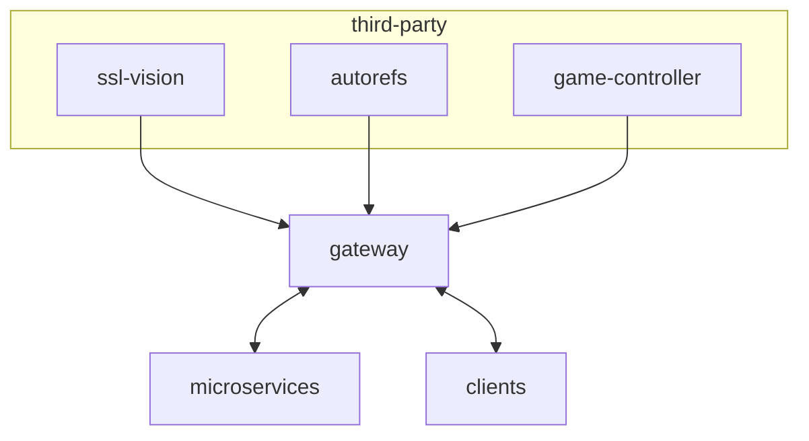

# gateway

This folder provides the API Gateway implementation responsible for enabling the communication between the client and third-party software with the microservices.

It deals with gRPC requests from the clients and is the entry point for the UDP multicast messages generated by the official competition software systems.

For unary gRPC requests related to game replay, it creates a client-server communication with the [playback-ms](../playback-ms/README.md) using [ZMQ_DEALER](https://libzmq.readthedocs.io/en/latest/zmq_socket.html#:~:text=Last%20peer-,ZMQ_DEALER,-A%20socket%20of) socket. 

For handling gRPC stream related to the game live, it has a [ZMQ_SUB](https://libzmq.readthedocs.io/en/latest/zmq_socket.html#:~:text=Drop-,ZMQ_SUB,-A%20socket%20of) socket subscribed in the queue of messages generated by the [playback-ms](../playback-ms/README.md). 

Finally, for the messages generated by the official competition software systems, it has a [ZMQ_PUB](https://libzmq.readthedocs.io/en/latest/zmq_socket.html#:~:text=spec%3A29.-,ZMQ_PUB,-A%20socket%20of) socket responsible for publishing the received messages with specific topics, allowing all subscribed microservices to receive them. 