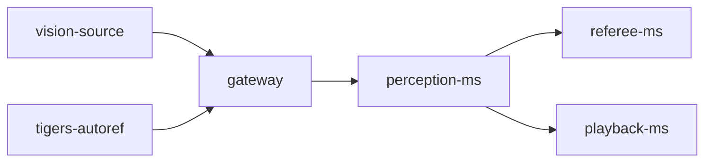

# perception-ms

This folder provides the microservice implementation responsible for receiving and processing the vision environment. The perception-ms is a crucial component designed to interface with a vision sources, such as [SSL Vision](https://github.com/RoboCup-SSL/ssl-vision), [simulator-cli](https://github.com/robotics-erlangen/framework) and [grSim](https://github.com/RoboCup-SSL/grSim), and [TIGERs Autoref](https://github.com/TIGERs-Mannheim/AutoReferee).

## How it works

The perception-ms receives raw vision packets from vision source and tracked packets from TIGERs Autoref. The perception-ms communicates with the gateway and services through ZeroMQ using a publisher-subscriber pattern by subscribing to all topics with relevant messages for vision processing, i.e., those sent by the vision source and the TIGERs Autoref, bridged on gateway. These packets are not received directly from external components but via an [API gateway](../gateway/README.md) that acts as a bridge between processing services and other components. 

For receiving data functionality, it implements a [ZMQ_SUB](https://libzmq.readthedocs.io/en/latest/zmq_socket.html#:~:text=Drop-,ZMQ_SUB,-A%20socket%20of) socket that receives data from the API Gateway.

The internal architecture of perception-ms employs a producer-consumer pattern to handle and process incoming vision data messages efficiently. This architecture ensures that the service can manage the flow of data from various sources, process it in real-time, and provide reliable outputs to other system components.

First, the service initializes and sets up a connection to the gateway. The producer listens for incoming vision packets from the configured vision source, which contain raw vision data, including information about the positions and states of objects on the field. It also receives tracked vision data from the TIGERs Autoref, which includes refined and processed object positions and states.

Upon receiving both raw and tracked vision packets, the producer aggregates these packets into a payload containing all the raw and tracked vision data received during a specific time window, ensuring a comprehensive view of the field and objects within it. The payload is sent to the consumer controller, which processes the aggregated vision data. The vision processing primarily involves a mapping workflow that parses the raw data to extract field information. To provide object positions, velocities, and other state data, it requires tracked vision data from the TIGERs Autoref to map to a predefined pattern defined by the [perception protocols](../protocols/protocols/perception/README.md).

Once the data is mapped, the consumer controller generates a [Detection and a DetectionWrapper](../protocols/protocols/perception/README.md). Both Detection and DetectionWrapper are sent through ZeroMQ middleware. The service employs a [ZMQ_PUB](https://libzmq.readthedocs.io/en/latest/zmq_socket.html#:~:text=Drop-,ZMQ_PUB,-A%20socket%20of) socket to publish both Detection and DetectionWrapper into different topics. This allows processing services such as [referee-ms](../referee-ms/README.md) to receive only the processed data, while services like [playback-ms](../playback-ms/README.md) can receive the full data information.