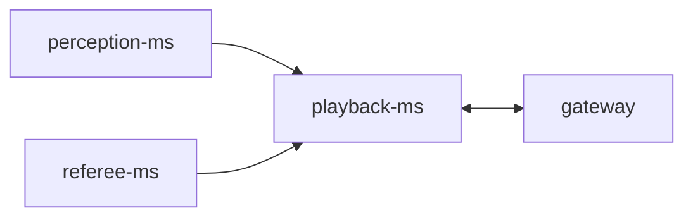

# playback-ms

This folder provides the microservice implementation responsible for providing all data needed to game live and replay.

It communicates with all microservices of the backend through ZeroMQ using a publisher-subscriber pattern by subscribing to all topics where relevant messages for creating a sample of an instant of the game are published, i.e., those sent by [perception-ms](../perception-ms/README.md) and [referee-ms](../referee-ms/README.md). Each sample is identified by the timestamp presented in the perception message and saved in a [Redis](https://redis.io/) database.  

For providing live functionality, it has a [ZMQ_PUB](https://libzmq.readthedocs.io/en/latest/zmq_socket.html#:~:text=Drop-,ZMQ_SUB,-A%20socket%20of) socket responsible for publishing all samples of the game so that the [API Gateway](../gateway/README.md) can correctly send the data when the client requests them. 

For replay functionality, it implements a [ZMQ_ROUTER](https://libzmq.readthedocs.io/en/latest/zmq_socket.html#:~:text=Block-,ZMQ_ROUTER,-A%20socket%20of) socket that receives a requisition from the API Gateway when the client request for a sample addressed in a specific timestamp. To improve latency and computation resource usage, it sends 5 seconds of information for each request, minimizing the number of messages exchanged through the network and the number of queries made in the database.