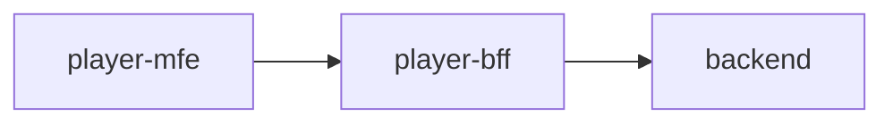

# player-bff

This folder contains the source code for the `Player` backend-for-frontend (BFF) of SSL Core. It is an application written in Go that provides the data needed by the [`player-mfe`](https://github.com/robocin/ssl-core/player-mfe).



## How it works

The `Player` BFF mediates communication between the microfrontend and the backend. It handles presentation and interaction logic without embedding any business logic.In [Domain-driven Design](https://en.wikipedia.org/wiki/Domain-driven_design) terms, it maps the backend subdomain (robot control and strategy) to the frontend subdomain (user features).

The BFF communicates with the backend through the [gateway](../gateway/README.md), using gRPC and with the clients via WebSocket. It maintains a single persistent connection to handle the livestream use case and notify all subscribed WebSocket connections from the `player-mfe` when a packet is received. Other features follow a flow where a client sends a message in the format `{ event: string, data: map[string]interface{} }`, the BFF sends a request to the gateway, processes the response, and sends it back to the client.

## Development

To run the application, use the following commands:

```bash
make setup
make run
```

### Codemap

- [`cmd`](player-sonson/cmd): Entry point of the BFF.
- [`internal`](player-sonson/internal): Internal packages and core application logic.
- [`transport`](player-sonson/transport): Transmission and receiving of messages.
