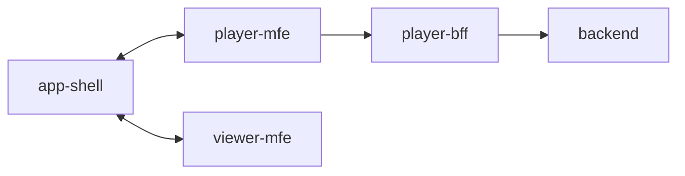

# player-mfe

This folder contains the source code for the `Player` microfrontend of SSL Core. It is a standalone application that is developed, tested, and deployed independently of other microfrontends. At runtime, it is composed in the browser through the [`app-shell`](https://github.com/robocin/ssl-core/app-shell).



## How it works

The `Player` microfrontend is responsible for synchronizing and controlling the playback of a match in the application. It is built as a web component that is seamlessly integrated into the [app-shell](../app-shell/README.md).

The `Player` sends `frame`-type messages to the [app-shell](../gateway/README.md)'s event bus:

```typescript
{
  type: "frame";
  payload: {
    serialId: number;
    startTime: Date;
    currentTime: Date;
    endTime: Date;
    fps: number;
    balls: {
      confidence: number;
      position: { x: number, y: number, z: number };
      velocity: { x: number, y: number, z: number };
    }[];
    robots: {
      confidence: number;
      robotId: number;
      robotColor: "blue" | "yellow";
      position: { x: number, y: number };
      angle: number;
      velocity: { x: number, y: number };
      angularVelocity: number;
      radius: number;
      height: number;
      dribblerWidth: number;
    }[];
    field: {
      length: number;
      width: number;
      goalDepth: number;
      goalWidth: number;
      penaltyAreaDepth: number;
      penaltyAreaWidth: number;
      boundaryWidth: number;
      goalCenterToPenaltyMark: number;
    };
  };
};
```

The application uses entities and data structures (such as `Buffer` and `Chunk`) to handle user events in the UI and ensure all microfrontends are synchronized with the same frame as the source of truth.

The application operates with a main thread and a web socket worker:

- **Main Thread**: Instantiates the Web Component, handles user events, and coordinates the playback.
- **Socket Worker**: Maintains a persistent connection with the [player-bff](../player-bff/README.md), offloading the main thread from the responsibility of sending and receiving messages.

## Development

To run the development server, use the following commands:

```bash
yarn
yarn dev
```

### Codemap

- [`public`](public): Static files for the microfrontend.
- [`src`](src): Source code for the microfrontend.
- [`src/app`](src/app): Core application logic.
- [`src/app/player-mfe.ts`](src/app/player-mfe.ts): Declaration of the web component.
- [`src/entities`](src/entities): Entities of the application.
- [`src/events`](src/events): Events dispatched within the application.
- [`src/lib`](src/lib): Reusable code modules.
- [`src/utils`](src/utils): Helpers and utility functions.
- [`src/workers`](src/workers): Workers entry point files.
- [`src/main.ts`](src/main.ts): Entry point of the microfrontend.
