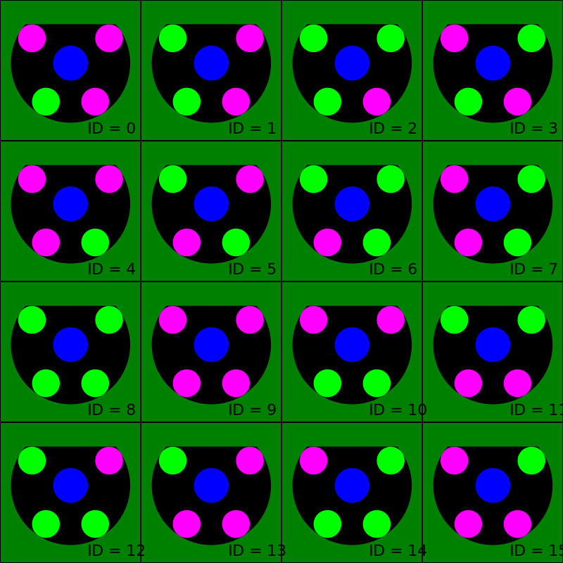

# Common

This directory contains common protobufs that are used across the project.

## Table of Contents

- [Common](#common)
  - [Table of Contents](#table-of-contents)
  - [`geometry`](#geometry)
  - [`robot_id`](#robot_id)

## [`geometry`](geometry.proto)

A collection of geometry-related messages.

- `Point2Df`: a 2D point (vector) with float coordinates;
  
  It should be preferred over 2D points with integer coordinates or double precision coordinates.

- `Point3Df`: a 3D point (vector) with float coordinates;
  
  As Point2Df, it should be preferred over 3D points with integer coordinates or double precision coordinates. Also, it should be used only when the third coordinate is needed, as in the case of a ball position due chip kicks, for example.

## [`robot_id`](robot_id.proto)

A collection of Robot Id-related messages.

_It is defined as a separate message to be reused for all the messages that need to identify a robot._

- `RobotId`: a robot id;
- `RobotId.Color`: a robot color;

> **Note**: In the image above, `color` is the primary color **blue**, and `number` is equivalent to the `id`.
