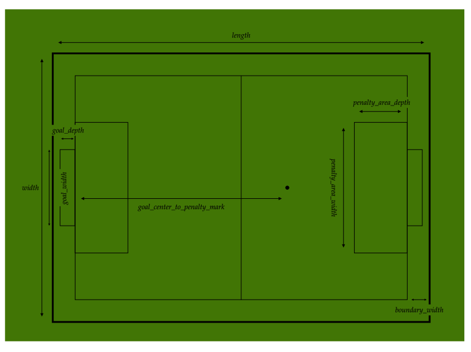

# perception

This directory contains the output of the perception service.

## Table of Contents

- [perception](#perception)
  - [Table of Contents](#table-of-contents)
  - [`detection`](#detection)

## [`detection`](detection.proto)

A collection of messages that compose the detection.

- `Detection`: the output of the perception service. It contains properties of its generation &#8211; such as unique id and generated time &#8211;, ball and robots &#8211; the main entities of the game &#8211;, and also contains the field dimensions which are sent periodically.

- `Ball`: a message containing the ball's kinematic properties.
- `Robot`: a message containing the robot's identification and kinematic properties.
- `Field`: a message containing the field's dimensions.

- `DetectionWrapper`: the message that encapsulates all types of detection available, including raw and tracked detections from third-party sources, and the processed detection.

> See [Dimensions at Rules of the RoboCup Small Size League](https://robocup-ssl.github.io/)
