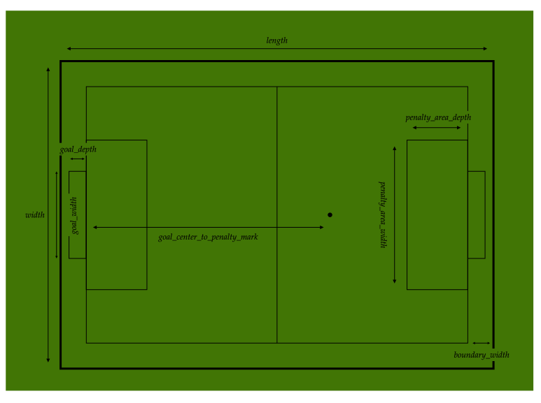

# vision

This directory contains the output of the vision service.

## Table of Contents

- [vision](#vision)
  - [Table of Contents](#table-of-contents)
  - [`frame`](#frame)

## [`frame`](frame.proto)

A collection of messages that compose the frame.

- `Frame`: the output of the vision service. It contains properties of its generation &#8211; such as unique id and generated time &#8211;, ball and robots &#8211; the main entities of the game &#8211;, and also contains the field dimensions which are sent periodically.

- `Ball`: a message containing the ball's kinematic properties.
- `Robot`: a message containing the robot's identification and kinematic properties.
- `Field`: a message containing the field's dimensions.

> See [Dimensions at Rules of the RoboCup Small Size League](https://robocup-ssl.github.io/ssl-rules/sslrules.html#_dimensions) for more information about the field dimensions.
