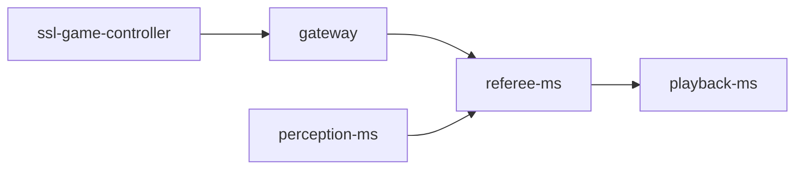

# referee

This folder provides the microservice implementation responsible for receiving and processing referee information. The referee-ms is a crucial component designed to interface with the [ssl-game-controller](https://github.com/RoboCup-SSL/ssl-game-controller) to receive referee data, and vision data from [perception-ms](../perception-ms/README.md) to be able to define the game status, matching the visual game state.

## How it works

The referee-ms receives perception packets from perception-ms and referee data from ssl-game-controller. The referee-ms communicates with the gateway and services through ZeroMQ using a publisher-subscriber pattern by subscribing to all topics with relevant messages for game status processing, i.e., those sent by the perception-ms and the ssl-game-controller. The perception packets are received directly through the ZeroMQ. The referee data are not received directly from the ssl-game-controller, though. The ssl-game-controller packets are received via an [API gateway](../gateway/README.md) that acts as a bridge between processing services and other components.

For receiving data functionality, it implements a [ZMQ_SUB](https://libzmq.readthedocs.io/en/latest/zmq_socket.html#:~:text=Drop-,ZMQ_SUB,-A%20socket%20of) socket that receives data from the API Gateway.

The internal architecture of referee-ms employs a producer-consumer pattern to handle and process incoming vision data messages efficiently. This architecture ensures that the service can manage the flow of data from various sources, process it in real-time, and provide reliable outputs to other system components.

First, the service initializes and sets up a connection to the gateway. The producer listens for incoming referee packets from the ssl-game-controller. It also receives vision data from the perception-ms.

Upon receiving both packet types, the producer aggregates these packets into a payload containing all data received during a specific time window, ensuring a comprehensive view of the field and objects within it. The payload is sent to the consumer controller, which processes the aggregated information. The referee processing primarily involves a mapping workflow that parses the input data to extract game information and map to a predefined pattern defined by the [referee protocols](../protocols/protocols/referee/README.md).

Once the data is mapped, the consumer controller generates a [GameStatus](../protocols/protocols/referee/README.md). The GameStatus is sent through ZeroMQ middleware. The service employs a [ZMQ_PUB](https://libzmq.readthedocs.io/en/latest/zmq_socket.html#:~:text=Drop-,ZMQ_PUB,-A%20socket%20of) socket to publish the GameStatus protocol to services that need referee information, such as [playback-ms](../playback-ms/README.md).