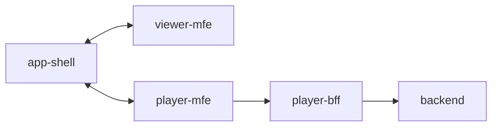

# viewer-mfe

This folder contains the source code for the `Viewer` microfrontend of SSL Core. It is a standalone application that is developed, tested, and deployed independently of other microfrontends. At runtime, it is composed in the browser through the [`app-shell`](https://github.com/robocin/ssl-core/app-shell).



## How it works

The `Viewer` microfrontend is responsible for displaying the SSL match. It is built as a web component that is seamlessly integrated into the [app-shell](../app-shell/README.md). This component renders match elements (e.g. robots, ball, field), shapes, and other related objects in a 3D environment. It also supports interaction with the environment, including moving, rotating, and zooming.

The `Viewer` listens to the `frame`-type messages of [app-shell](../app-shell/README.md)'s event bus:

```typescript
{
  type: "frame";
  payload: {
    serialId: number;
    startTime: Date;
    currentTime: Date;
    endTime: Date;
    fps: number;
    balls: {
      confidence: number;
      position: { x: number, y: number, z: number };
      velocity: { x: number, y: number, z: number };
    }[];
    robots: {
      confidence: number;
      robotId: number;
      robotColor: "blue" | "yellow";
      position: { x: number, y: number };
      angle: number;
      velocity: { x: number, y: number };
      angularVelocity: number;
      radius: number;
      height: number;
      dribblerWidth: number;
    }[];
    field: {
      length: number;
      width: number;
      goalDepth: number;
      goalWidth: number;
      penaltyAreaDepth: number;
      penaltyAreaWidth: number;
      boundaryWidth: number;
      goalCenterToPenaltyMark: number;
    };
  };
};
```

The application operates with a main thread and two web workers:

- **Main Thread**: Instantiates the Web Component, handles user events, and coordinates rendering.
- **Communication Worker**: Listens to the Event Bus, filters, processes messages, and sends them to the rendering worker via a Broadcast Channel.
- **Rendering Worker**: Uses Three.js to render the 3D environment. This worker is responsible for the actual drawing and updating of the match objects.

## Development

To run the development server, use the following commands:

```bash
yarn
yarn dev
```

### Codemap

- [`public`](public): Static files for the microfrontend.
- [`src`](src): Source code for the microfrontend.
- [`src/app`](src/app): Core of application development.
- [`src/app/engines`](src/app/engines): Rendering engines to the game match.
- [`src/app/communication`](src/app/communication): Communication with the event bus.
- [`src/app/viewer-mfe.ts`](src/app/viewer-mfe.ts): Declaration of the web component.
- [`src/config`](src/config): Configuration files.
- [`src/utils`](src/utils): Helpers and utility functions.
- [`src/main.ts`](src/main.ts): Entry point of the microfrontend.
